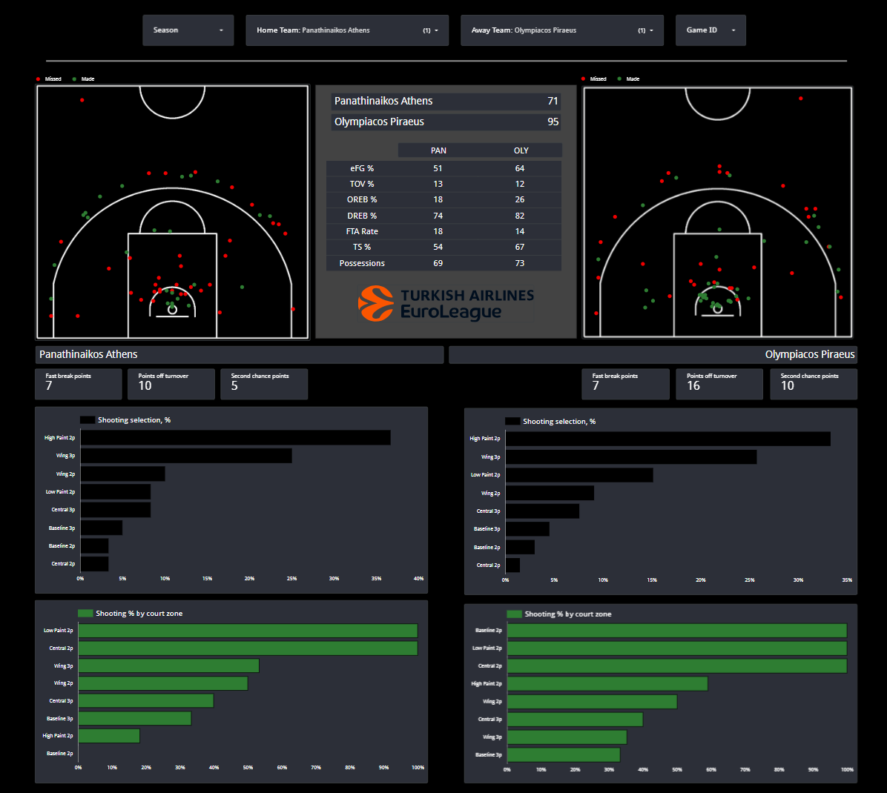

# Drazen - Euroleague basketball game reports
Drazen is an end-to-end project which generates a report for each Euroleague basketball game played since the 2007-2008 season to explore teams' key performance indicators.
Data are scrapped from three separate sources of the Euroleague website (play-by-play, box scores, and shot locations). The tools used are: Python, Google Storage & Bigquery, DBT, and Looker Studio.

## Architecture 

### Overview

* Python scripts extract the data from the Euroleague website, perform some data cleaning add add additional variables (e.g. action shot clock). They then load final tables on Google Storage buckets.
* Bigquery is used as cloud data warehouse.
* DBT is used for data transformations, testing, and data models documentation.
* Looker Studio is used for data visualization and hosts the final dashboard.
