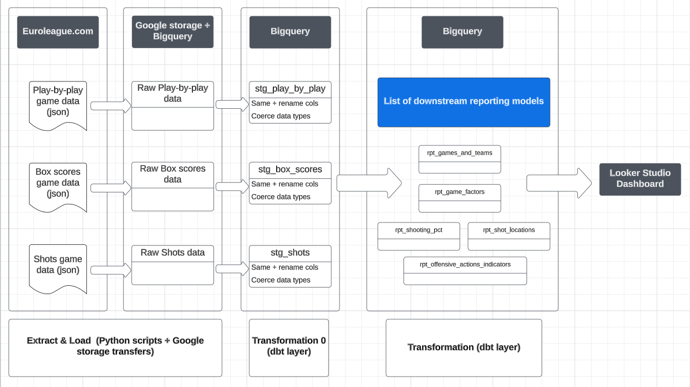

# Drazen - Euroleague basketball game reports
Drazen is an end-to-end project which generates a report for each Euroleague basketball game played since the 2007-2008 season to explore teams' key performance indicators.
Data are scraped from three separate sources of the Euroleague website (play-by-play, box scores, and shot locations). The tools used are: Python, Google Storage & Bigquery, dbt, and Looker Studio.

## Architecture 

### Tools

* Python scripts extract the data from the Euroleague website, perform some data cleaning steps and add additional variables. They then load final tables on Google Storage buckets.
* Bigquery is used as cloud data warehouse.
* dbt is used for data transformations, testing, and data models documentation.
* Looker Studio is used for data visualization and hosts the final dashboard.

### Data pipeline overview

### DBT Models 
* dbt is used as transformation layer. Coding and testing convensions are set out [here](./dbt/BigQuery/README.md).
* The documentation for this project can be accessed from this link, while the DAG is reported below

